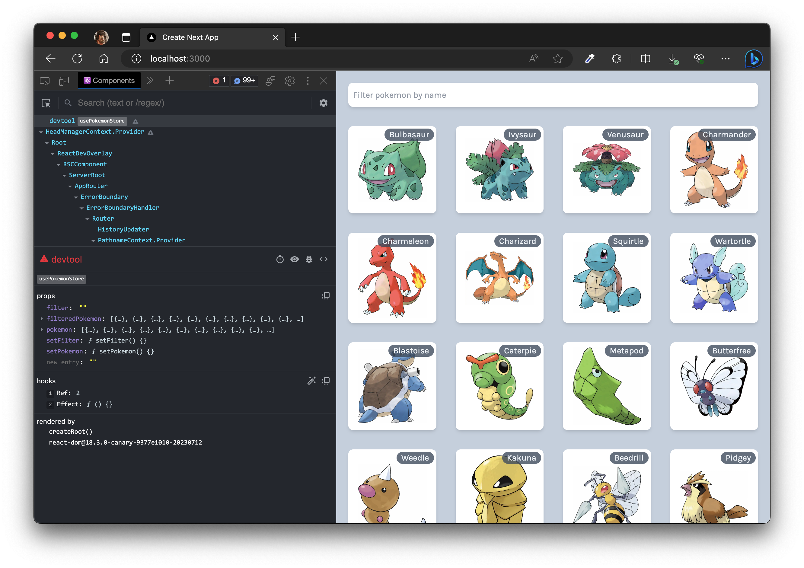

# State Management in Next.js

> With React Hooks, React Context, Zustand, and React Query

Welcome to this (Pokémon) state management sandbox where we dive deep into state management within a Next.js application.

Our journey will be guided using the data set from [`https://jherr-pokemon.s3.us-west-1.amazonaws.com/index.json`](https://jherr-pokemon.s3.us-west-1.amazonaws.com/index.json). While the data remains constant, our approach to rendering, searching, and filtering Pokémon will vary based on the state management technique used.

## Table of Contents

**1. Local State with React State Hooks**

Using the power of React’s `useState` and `useEffect` hooks, learn how to manage Pokémon data at the component level, allowing for rendering and local filtering.

**2. Need for Global State Management**

Discover why, in more complex applications, a localized state might not be enough. How does the shared Pokémon data prompt us to think about state more globally?

**3. Global State with React Context**

Leverage React Context to avoid prop-drilling and manage our Pokémon data across components. Here, we'll demonstrate how to set up a global state and consume it in various parts of our application.

**4. Global State with Zustand**

See how Zustand provides an elegant solution for global state management. We'll set up Zustand stores and use them to render and search through our Pokémon data in a global context.

**5. Client-Side Data Caching with React Query**

Venture into the realm of data-fetching with React Query. Learn to efficiently fetch the Pokémon data, cache it, and create a seamless user experience in your Next.js app.

**6. Hydrating Clients using React Query and RSC components**

Combining React Server Components (RSC) with React Query, we explore how to hydrate the client after receiving the initial server-rendered Pokémon data, ensuring efficient rendering and filtering.

**7. Additional Resources**

For a deeper dive into the concepts covered in this sandbox and supplementary information, please refer to the attached **PDF** document called `state-management-in-nextjs.pdf`.

Regards,  
Luigi Lupini  
 
I ❤️ all things (🇮🇹 / 🛵 / ☕️ / 👨‍👩‍👧) 